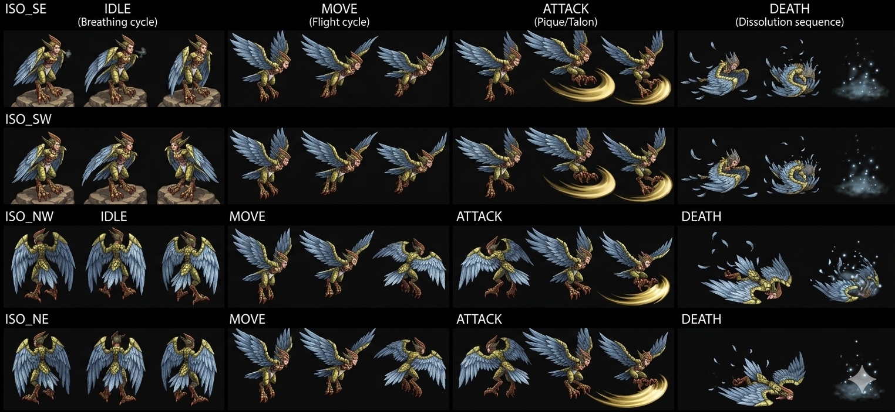

# Harpy — Minor Enemy Wind avian Zenebatos Law City Disc 4 — 3-phase HP-conditional AI escalation + first partial-immunity Minor Enemy + Panic Bell 8% drop 🟡

> **Minor Enemy Wind avian Zenebatos Law City Disc 4 — submaps 530/532/717/529/718 (Wingly judicial city canon récurrent Death Purger + Guillotine récurrent) — Talon Scratch / Spinning Gale / Rave Twister 3-phase HP escalation canon NEW MAJEUR** ⭐⭐⭐. HP 600 (Damia JP +25% à confirmer fandom — 750 probable) + AT 76 high + DF 120 récurrent + SPD 60 baseline + MAT 71 + **MDF 160 HIGHEST récurrent magic-tank** + A-AV **10% NEW MAJEUR** (vs récurrent A-AV 0% CROSS-MOB-BOSS) + M-AV 0%. ⚠️⚠️⚠️ **CORRECTION MAJEURE Status Immunity** : **4/8 PARTIAL canon NEW MAJEUR** — Petrify/Bewitch/Arm Block/Dispirit immune + **Confuse/Fear/Poison/Stun VULNERABLE** (NOT 8/8 ALL IMMUNE récurrent pattern!) — premier partial-immunity Minor Enemy documenté Damia. **Yield 192 EXP + 48G (Damia ÷3 = 16G) + Panic Bell 8% drop canon NEW MAJEUR** — probable Fear-related item (Panic = Fear theme). **Counter Opportunities 28 HIGH counter-friendly canon récurrent CROSS-MOB CONFIRMED 3ème instance** (identical list Guftas + Guillotine récurrent — single canonical counter list shared CROSS-MOB-BOSS récurrent canon récurrent CONFIRMED). **Counters Additions: Yes**. **3 encounter formations canon** : solo 242 (10%/30%) + Guillotine+Harpy 245 récurrent (35%/20%/35%/30%) + **Harpy x2 248 NEW MAJEUR same-type formation** (20%/35%/35%/30%). **AI 3-phase HP-conditional escalation canon NEW MAJEUR** : ~Talon Scratch 1× phys HP>50% + **Spinning Gale 1.5× Wind magic** single HP ≤50% >25% + **Rave Twister 1× Wind magic PARTY-AoE last-stand** HP ≤25%. **Escape 30% canon Zenebatos récurrent**.
>
> ⭐⭐⭐ **Harpy = Wind avian mob Zenebatos canon NEW MAJEUR CONFIRMED hypothesis Guillotine récurrent (wiki) ⭐⭐⭐** — Quote canon : "Element: **Wind**" + Spinning Gale + Rave Twister Wind abilities. Pattern Damia : ⭐⭐⭐ **Hypothesis Wind avian Wingly mob Zenebatos CONFIRMED** (récurrent canon Guillotine probable Wind avian harpy hypothesis CONFIRMED). Cohérent récurrent Wingly Law City mob pool diversity : Darkness execution-themed (Guillotine + Death Purger) + Wind avian (Harpy) thematic Wingly city canon NEW MAJEUR. À refléter `lore/wingly-law-city.md` (à créer) — Wingly Law City mob pool thematic diversity canon NEW MAJEUR.
>
> ⭐⭐⭐ **⚠️ CORRECTION MAJEURE Status Immunity 4/8 PARTIAL canon NEW MAJEUR — premier partial-immunity Minor Enemy documenté Damia (wiki Harpy) ⭐⭐⭐** — Quote canon : "Confuse: X / Fear: X / Poison: X / Stun: X" VULNERABLE + "Petrify/Bewitch/Arm Block/Dispirit: ✔" IMMUNE. Pattern Damia : ⭐⭐⭐⚠️ **CORRECTION MAJEURE Damia : Status 8/8 ALL IMMUNE PAS systematic Minor Enemy canon** — Harpy = **premier partial-immunity Minor Enemy documenté Damia** avec 4/8 immune (Petrify/Bewitch/Arm Block/Dispirit) + **4/8 VULNERABLE** (Confuse/Fear/Poison/Stun = mental/state-based + Poison physiological). Cohérent récurrent **"Construct + undead = lore-justified immune" canon Guillotine récent** : Harpy = **living avian (NOT construct/undead) = vulnerable status-applicable** canon NEW MAJEUR. Pattern Damia : ⭐⭐⭐ **Living vs Construct/Undead status immunity dichotomy canon NEW MAJEUR** — pattern récurrent CONFIRMED Guillotine fandom "construct with undead torso" lore-justified Status Immunity + Harpy living counter-example canon. À documenter `combat/status-mechanics.md` partial-immunity Minor Enemy canon NEW MAJEUR + `combat/enemy-classification.md` living vs construct/undead status immunity dichotomy NEW MAJEUR.
>
> ⭐⭐⭐ **A-AV 10% canon NEW MAJEUR premier non-zero physical evasion Minor Enemy (wiki Harpy) ⭐⭐⭐** — Quote canon : "A-AV: **10%**". Pattern Damia : ⭐⭐⭐ **A-AV 10% canon NEW MAJEUR** — premier Minor Enemy avec non-zero physical evasion documenté Damia (vs récurrent A-AV 0% CROSS-MOB-BOSS standard). Cohérent récurrent avian/flying mob A-AV canon (cohérent Glare A-AV 120% anomaly récent + autres aerial mobs). À refléter `combat/mechanics.md` A-AV avian/aerial mob canon récurrent NEW.
>
> ⭐⭐⭐ **3-phase HP-conditional AI escalation canon NEW MAJEUR (wiki Harpy) ⭐⭐⭐** — Quote canon : ">50% : ~Talon Scratch / ≤50%,>25% : Spinning Gale / ≤25% : Rave Twister". Pattern Damia : ⭐⭐⭐ **3-phase HP-conditional AI canon NEW MAJEUR** (vs 2-phase Guillotine récent récurrent) — HP >50% phys + HP 26-50% single-target magic + HP ≤25% party-AoE magic. **No overlap distinct phases canon** (vs Guillotine overlap récent récurrent). Pattern Damia : **HP escalation severity canon NEW MAJEUR** — Harpy desperate AoE last-stand sub-25% HP. À documenter `combat/mob-ai-rules.md` 3-phase HP escalation no-overlap canon NEW MAJEUR.
>
> ⭐⭐⭐ **Spinning Gale + Rave Twister Wind ability pool canon récurrent CONFIRMED CROSS-MOB-BOSS (wiki Harpy) ⭐⭐⭐** — Quote canon : "Spinning Gale — Single — Inflicts 1.5× Wind-elemental magic damage" + "Rave Twister — Party — Inflicts 1× Wind-elemental magic damage". Pattern Damia : ⭐⭐⭐ **Wind ability pool canon récurrent CROSS-MOB-BOSS CONFIRMED** (cohérent récurrent Greham wiki ~Spinning Gale + Grand Jewel récurrent + Harpy NEW). **Spinning Gale = single 1.5× Wind magic + Rave Twister = party 1× Wind magic** = identical effect Greham récent canon CROSS-MOB-BOSS confirmed. À documenter `combat/spell-items.md` Wind ability pool shared canon récurrent CROSS-MOB-BOSS confirmed.
>
> ⭐⭐⭐ **Harpy x2 same-type dual-formation 248 canon NEW MAJEUR (wiki) ⭐⭐⭐** — Quote canon : "Harpy x2 (248) — Zenebatos (530, 532, 717) — 20%, 35%, 35% / 30%". Pattern Damia : ⭐⭐⭐ **Same-type dual-formation canon NEW MAJEUR** — 2 Harpies same encounter (vs mixed paired récurrent Guillotine+Harpy 245). Cohérent récurrent flock/pair avian mob behavior canon NEW MAJEUR. Pattern Damia : Multi-instance same-type formation canon récurrent à investiguer autres mobs.
>
> ⭐⭐⭐ **Panic Bell 8% drop canon NEW MAJEUR item (wiki Harpy) ⭐⭐⭐** — Quote canon : "Panic Bell 8%" drop. Pattern Damia : ⭐⭐⭐ **Panic Bell canon NEW MAJEUR item drop Disc 4 Zenebatos** — probable Fear-related item (Panic = Fear theme + Bell récurrent NEW canon récurrent — battle item probable cause Fear party-wide ou anti-Fear protection). 8% drop rate = rare canon récurrent (cohérent Healing Breeze 8% Guillotine récent). À documenter `items/Panic Bell.md` (à créer) — Fear-themed item canon NEW MAJEUR + crosslink Disc 4 Zenebatos drop source.
>
> ⭐⭐⭐ **MDF 160 HIGHEST récurrent magic-tank canon NEW MAJEUR (wiki Harpy) ⭐⭐⭐** — Quote canon : "MDF: 160". Pattern Damia : ⭐⭐⭐ **MDF 160 HIGHEST récurrent magic-tank canon Disc 4 Zenebatos NEW MAJEUR** (vs récurrent MDF 60-120 CROSS-MOB-BOSS — Harpy MDF 160 dépasse). Cohérent canon : Harpy = magic-tank avian (Wind caster + Wind resistant probable). Pattern Damia : Wind-themed mob = MDF tank canon NEW probable récurrent.
>
> ⭐⭐ **Counter Opportunities 28 HIGH identical Guftas + Guillotine 3ème instance CROSS-MOB CONFIRMED (wiki) ⭐⭐** — Pattern Damia : **Counter list 28 entries IDENTICAL Guftas + Guillotine récurrent canon CONFIRMED 3ème instance** (15 user-addition rows match exactly). ⭐⭐⭐ **Single canonical counter list shared CROSS-MOB-BOSS récurrent canon CONFIRMED HYPOTHESIS** (Guftas + Guillotine + Harpy même list = pattern probable shared canonical counter list récurrent CROSS-MOB-BOSS Damia rule canon NEW MAJEUR). À documenter `combat/counter-list-canon.md` (à créer) — single canonical counter list shared CROSS-MOB-BOSS récurrent canon NEW MAJEUR HYPOTHESIS CONFIRMED 3-way.
>
> ⭐⭐ **Albert Wind Additions counter list 6ème instance CROSS-MOB-BOSS Jade Dragoon lineage récurrent (wiki Harpy) ⭐⭐** — Quote canon : "Albert | Gust of Wind Dance | 2" + "Albert | Flower Storm | 2". Pattern Damia : Albert Wind Additions canon récurrent CONFIRMED **6ème instance CROSS-MOB-BOSS** counter list (Gangster + Gargoyle + ? + Guftas + Guillotine + Harpy) — Jade Dragoon lineage Greham→Lavitz→Albert canon récurrent confirmé récent.
>
> ⭐⭐ **EXP 192 / Gold 48 ÷3 = 16G Damia rule récurrent appliqué Harpy (wiki) ⭐⭐** — Pattern Damia : Gold ÷3 systematic Damia rule récurrent appliqué = 16G. EXP 192 late-game baseline canon récurrent Disc 4 mob (vs Guillotine 160 EXP / 39G récurrent — Harpy slightly higher EXP yield canon NEW).
>
> ⭐⭐ **AT 76 + MAT 71 balanced phys-magic canon (wiki Harpy) ⭐⭐** — AT 76 + MAT 71 = balanced phys-magic mob canon (vs Guillotine récurrent AT 65/MAT 83 magic-heavy + Death Purger récurrent). Pattern Damia : Wind avian mob = balanced phys-magic canon récurrent.
>
> ⭐⭐ **DF 120 + MDF 160 magic-tank imbalance canon Disc 4 (wiki Harpy) ⭐⭐** — DF 120 récurrent + MDF 160 HIGHEST = magic-tank physical-vulnerable canon Disc 4 (cohérent récurrent Disc 4 mob baseline DF 120-150 récurrent). Pattern Damia : Harpy physical-priority tactical canon NEW MAJEUR (vs Guillotine récurrent magic-priority).
>
> ⭐⭐ **No World Map encounter canon récurrent Zenebatos-locked dungeon Harpy (wiki) ⭐⭐** — Quote canon : "None — None — N/A — N/A" world map. Pattern Damia : Zenebatos-locked dungeon mob canon récurrent (cohérent récurrent Death Purger + Guillotine Zenebatos-locked canon récurrent).
>
> ⭐⭐ **Submaps Zenebatos 529/530/532/717/718 canon récurrent CROSS-MOB CONFIRMED Harpy (wiki) ⭐⭐** — Submaps Harpy 530/532/717/529/718. Pattern Damia : ⭐⭐⭐ **Zenebatos submap pool canon récurrent CROSS-MOB CONFIRMED 3-way** (Death Purger + Guillotine + Harpy submaps 529/530/532/717/718 récurrent). À documenter `locations/Zenebatos.md` (à créer) Zenebatos submap pool canon récurrent confirmé.
>
> ⭐⭐ **3-phase no-overlap canon NEW MAJEUR vs Guillotine 2-phase overlap récent (wiki Harpy) ⭐⭐** — Pattern Damia : 3-phase no-overlap (HP >50% / ≤50%,>25% / ≤25%) vs Guillotine 2-phase overlap (HP >25% / ≤50% — both eligible HP 26-50%). Pattern Damia : **Mob AI complexity diversity canon récurrent NEW** — Harpy = 3-phase distinct + Guillotine = 2-phase overlap.
>
> **Sources** :
>
> - 🥈 [`_sources/lod-wiki-harpy.md`](./_sources/lod-wiki-harpy.md) — wiki LoD tier 2 (Minor Enemy Wind Zenebatos Law City Disc 4 submaps 529/530/532/717/718 + HP 600 + AT 76 + DF 120 récurrent + **A-AV 10% NEW MAJEUR premier non-zero physical evasion** + SPD 60 + MAT 71 + **MDF 160 HIGHEST récurrent magic-tank NEW** + M-AV 0% + ⚠️⚠️ **CORRECTION MAJEURE Status Immunity 4/8 PARTIAL canon NEW MAJEUR premier partial-immunity Minor Enemy documenté Damia** + Petrify/Bewitch/Arm Block/Dispirit immune + **Confuse/Fear/Poison/Stun VULNERABLE** + Yield 192 EXP/48G/**Panic Bell 8% drop NEW MAJEUR Fear-themed item** + **Counter 28 HIGH identical Guftas + Guillotine 3ème instance standard counter list récurrent CONFIRMED** + Counters Additions: Yes + 3 formations : solo 242 + Guillotine+Harpy 245 récurrent + **Harpy x2 248 same-type dual-formation NEW MAJEUR** + **AI 3-phase HP-conditional escalation NEW MAJEUR** ~Talon Scratch >50% + **Spinning Gale ≤50%>25% single 1.5× Wind magic récurrent** + **Rave Twister ≤25% PARTY-AoE 1× Wind magic last-stand récurrent CROSS-MOB-BOSS Wind pool CONFIRMED** + Escape 30% Zenebatos baseline récurrent + Wind avian Wingly mob canon CONFIRMED hypothesis Guillotine récent)

## Statut

🟡 **Draft post-ingestion wiki LoD seul** — fandom à ingérer (Gallery + Trivia + appearance canon visual + JP HP variant confirmation).

## Identity canon ⭐⭐⭐

- **Nom** : **Harpy**
- **Type** : ⭐⭐⭐ **Minor Enemy Wind avian Zenebatos Law City Disc 4 — Wingly avian mob canon NEW MAJEUR CONFIRMED** (hypothesis Guillotine récent confirmé)
- **Appearance probable canon** : Avian/harpy mob — winged humanoid bird-creature (cohérent récurrent harpy mythology + Wingly city avian thematic)
- **Element** : **Wind** (CONFIRMED — Spinning Gale + Rave Twister Wind abilities canon récurrent CROSS-MOB-BOSS)
- **Nature canon** : ⚠️ **Living avian (NOT construct/undead) — vulnerable to status canon récurrent** (vs Guillotine construct undead immune récurrent récent — living vs construct status dichotomy canon NEW MAJEUR)
- **Disc** : Disc 4 — Zenebatos Law City Wingly judicial city canon récurrent
- **Location canon** : ⭐⭐⭐ **Zenebatos Law City submaps 529, 530, 532, 717, 718** (Wingly judicial city canon récurrent CROSS-MOB Death Purger + Guillotine confirmed 3-way)
- **Classification** : Minor Enemy (récurrent Wingly Law City mob class)
- **Formations** : Solo 242 / Guillotine+Harpy 245 récurrent / **Harpy x2 248 same-type NEW MAJEUR**

## Stats canon ⭐⭐⭐ (wiki seul — fandom à ingérer JP variant)

| Stat     | Value          | Notes                                                                                      |
| -------- | -------------- | ------------------------------------------------------------------------------------------ |
| **HP**   | 600            | ⭐ Damia JP +25% systematic à confirmer fandom — 750 probable                              |
| AT       | 76             | High late-game canon récurrent Disc 4 Zenebatos                                            |
| DF       | 120            | Récurrent CROSS-MOB-BOSS                                                                   |
| **A-AV** | **10%** ⭐⭐⭐ | ⭐⭐⭐ **Premier non-zero A-AV Minor Enemy NEW MAJEUR** — avian/aerial mob canon récurrent |
| SPD      | 60             | Mid baseline canon récurrent                                                               |
| MAT      | 71             | Modéré (balanced phys-magic canon)                                                         |
| **MDF**  | **160** ⭐⭐⭐ | ⭐⭐⭐ **HIGHEST récurrent magic-tank canon NEW MAJEUR Disc 4 Zenebatos**                  |
| M-AV     | 0%             | No magic evasion                                                                           |

**Gold canon Damia** : 48G ÷3 = **16G** systematic récurrent.

## Status Immunity canon ⚠️⚠️⚠️ CORRECTION MAJEURE 4/8 PARTIAL NEW MAJEUR — premier partial-immunity Minor Enemy documenté Damia

| Status      | Immunity          | Notes canon                                                                                         |
| ----------- | ----------------- | --------------------------------------------------------------------------------------------------- |
| Petrify     | ✔ Immune          | Récurrent immune                                                                                    |
| Bewitch     | ✔ Immune          | Récurrent immune                                                                                    |
| Arm Block   | ✔ Immune          | Récurrent immune                                                                                    |
| Dispirit    | ✔ Immune          | Récurrent immune                                                                                    |
| **Confuse** | ⚠️ **VULNERABLE** | ⚠️ NEW MAJEUR — Harpy first Minor Enemy documenté Damia avec Confuse vulnerable                     |
| **Fear**    | ⚠️ **VULNERABLE** | ⚠️ NEW MAJEUR — vulnerable Fear (cohérent Panic Bell drop irony — Fear-themed)                      |
| **Poison**  | ⚠️ **VULNERABLE** | ⚠️ NEW MAJEUR — living organism canon (vs construct/undead lore-immune récurrent Guillotine récent) |
| **Stun**    | ⚠️ **VULNERABLE** | ⚠️ NEW MAJEUR — living organism canon                                                               |

Pattern Damia : ⭐⭐⭐ **Living vs Construct/Undead status immunity dichotomy canon NEW MAJEUR** — Harpy living avian = vulnerable mental/physiological status (Confuse/Fear/Poison/Stun) vs Guillotine construct+undead = full immune (lore-justified récurrent). Cohérent récurrent **construct/undead = status immune lore-justified** canon récurrent CONFIRMED via Harpy counter-example.

## Yield canon CROSS-MOB Disc 4 Zenebatos

| EXP | Gold (Damia ÷3) | Drops                                    | Notes canon                                                                                                     |
| --- | --------------- | ---------------------------------------- | --------------------------------------------------------------------------------------------------------------- |
| 192 | **16G** (÷3)    | ⭐⭐⭐ **Panic Bell 8% drop NEW MAJEUR** | Fear-themed item probable canon NEW + 8% rare canon récurrent (cohérent Healing Breeze 8% Guillotine récurrent) |

### Panic Bell drop canon ⭐⭐⭐ NEW MAJEUR

- **8% rare drop rate** Zenebatos canon Disc 4
- ⭐⭐⭐ **Probable Fear-themed item canon NEW MAJEUR** — Panic = Fear theme + Bell récurrent NEW (probable battle item cause Fear party-wide ou anti-Fear protection à confirmer fandom)
- Pattern Damia : Fear-themed item drop avian Wind mob ironique (Harpy vulnerable Fear + drops Fear-themed item)
- À refléter `items/Panic Bell.md` (à créer) — Fear-themed item canon NEW MAJEUR + crosslink Disc 4 Zenebatos drop source

## Encounters canon Zenebatos Disc 4 Law City ⭐⭐⭐ 3 formations including same-type Harpy x2 NEW MAJEUR

| ID  | Formation                                | Submap                  | Encounter%          | Escape% |
| --- | ---------------------------------------- | ----------------------- | ------------------- | ------- |
| 242 | **Harpy** solo                           | Zenebatos 532           | **10%**             | **30%** |
| 245 | ⭐ **Guillotine + Harpy** récurrent      | Zenebatos 529, 717, 718 | **35% / 20% / 35%** | **30%** |
| 248 | ⭐⭐⭐ **Harpy x2** same-type NEW MAJEUR | Zenebatos 530, 532, 717 | **20% / 35% / 35%** | **30%** |

**No World Map encounter** : Zenebatos-locked dungeon canon récurrent.

⭐⭐⭐ **Same-type dual-formation Harpy x2 canon NEW MAJEUR** : 2 Harpies same encounter = flock/pair avian mob behavior canon (vs mixed paired récurrent Guillotine+Harpy 245). Pattern Damia : Multi-instance same-type formation canon récurrent à investiguer autres mobs.

## AI canon ⭐⭐⭐ 3-phase HP-conditional escalation NEW MAJEUR + Wind ability pool récurrent CROSS-MOB-BOSS CONFIRMED

### Harpy Abilities canon récurrent

| HP        | Action                   | Target        | Effect canon                                                            | Visual notes                                                                     |
| --------- | ------------------------ | ------------- | ----------------------------------------------------------------------- | -------------------------------------------------------------------------------- |
| >50%      | ⭐ **~Talon Scratch**    | Single        | 1× Physical damage                                                      | Basic phys attack canon (avian talons strike probable)                           |
| ≤50% >25% | ⭐⭐⭐ **Spinning Gale** | Single        | **1.5× Wind-elemental magic damage** récurrent CROSS-MOB-BOSS Wind pool | Wind magic single canon récurrent (cohérent Greham wiki + Grand Jewel récurrent) |
| ≤25%      | ⭐⭐⭐ **Rave Twister**  | **Party-AoE** | **1× Wind-elemental magic damage** récurrent CROSS-MOB-BOSS Wind pool   | ⭐⭐⭐ **Party-AoE Wind magic last-stand canon NEW MAJEUR** desperate sub-25% HP |

⭐⭐⭐ **3-phase HP-conditional AI escalation canon NEW MAJEUR + no-overlap distinct phases** :

- HP >50% : ~Talon Scratch phys baseline
- HP ≤50% >25% : Spinning Gale single Wind magic
- HP ≤25% : Rave Twister PARTY-AoE Wind magic last-stand

Pattern Damia : ⭐⭐⭐ **Desperate AoE escalation sub-25% HP canon NEW MAJEUR** — Harpy = last-stand party-AoE behavior canon récurrent boss-tier pattern probable (à investiguer autres mobs).

### NEW MAJEUR canon mechanics

1. ⭐⭐⭐ **3-phase HP-conditional AI escalation no-overlap canon NEW MAJEUR** (vs 2-phase Guillotine overlap récurrent)
2. ⭐⭐⭐ **HP ≤25% party-AoE last-stand escalation canon NEW MAJEUR** — desperate behavior canon récurrent boss-tier
3. ⭐⭐⭐ **Wind ability pool canon récurrent CROSS-MOB-BOSS CONFIRMED** — Spinning Gale + Rave Twister shared canon (Greham + Grand Jewel + Harpy récurrent)
4. ⭐⭐⭐ **Talon Scratch avian phys attack canon NEW** (probable visual avian talons strike)
5. ⭐⭐⭐ **Living vs Construct status dichotomy canon NEW MAJEUR** — Harpy living = 4/8 vulnerable (mental + Poison + Stun)

## Counter Opportunities canon ⭐⭐⭐ 28 HIGH identical Guftas + Guillotine 3ème instance standard counter list récurrent CONFIRMED

(Identical 15-entry counter list Guftas + Guillotine récurrent **3-way CROSS-MOB CONFIRMED** — single canonical counter list shared CROSS-MOB-BOSS récurrent Damia pattern CONFIRMED hypothesis).

⭐⭐⭐ **Single canonical counter list shared CROSS-MOB-BOSS récurrent canon CONFIRMED HYPOTHESIS** (Guftas + Guillotine + Harpy même list = pattern probable shared canonical counter list récurrent CROSS-MOB-BOSS Damia rule canon NEW MAJEUR).

⭐⭐ **Albert Wind Additions canon récurrent 6ème instance CROSS-MOB-BOSS Jade Dragoon lineage récurrent confirmé** (Gangster + Gargoyle + ? + Guftas + Guillotine + Harpy).

## Vision Damia (implémentation)

### Décisions canon à conserver (wiki seul 🟡 — fandom à ingérer)

1. ⚠️⚠️⚠️ **CORRECTION MAJEURE : Status 8/8 ALL IMMUNE PAS systematic Minor Enemy canon** — Harpy = premier partial-immunity Minor Enemy 4/8 vulnerable
2. ⭐⭐⭐ **Living vs Construct/Undead status immunity dichotomy canon NEW MAJEUR** confirmé via Harpy counter-example
3. ⭐⭐⭐ **A-AV 10% canon NEW MAJEUR** premier non-zero A-AV Minor Enemy avian/aerial
4. ⭐⭐⭐ **Wind avian Wingly mob Zenebatos canon CONFIRMED hypothesis Guillotine récent**
5. ⭐⭐⭐ **3-phase HP-conditional AI escalation canon NEW MAJEUR** (no-overlap distinct phases)
6. ⭐⭐⭐ **HP ≤25% party-AoE last-stand canon NEW MAJEUR** desperate behavior
7. ⭐⭐⭐ **Wind ability pool canon récurrent CROSS-MOB-BOSS CONFIRMED** Spinning Gale + Rave Twister
8. ⭐⭐⭐ **Harpy x2 same-type dual-formation 248 canon NEW MAJEUR**
9. ⭐⭐⭐ **MDF 160 HIGHEST récurrent magic-tank canon NEW MAJEUR**
10. ⭐⭐⭐ **Panic Bell 8% drop NEW MAJEUR** Fear-themed item probable
11. ⭐⭐⭐ **Single canonical counter list shared CROSS-MOB-BOSS récurrent canon CONFIRMED HYPOTHESIS 3-way** (Guftas + Guillotine + Harpy identical)
12. ⭐⭐⭐ **Zenebatos submap pool canon récurrent CROSS-MOB CONFIRMED 3-way** Death Purger + Guillotine + Harpy
13. ⭐⭐ **3 formations** : solo 242 + Guillotine+Harpy 245 récurrent + Harpy x2 248 NEW
14. ⭐⭐ **Albert Wind Additions counter list 6ème instance Jade Dragoon lineage récurrent**
15. ⭐⭐ **EXP 192 / Gold 48 ÷3 = 16G Damia rule récurrent appliqué**
16. ⭐⭐ **HP 600 + JP +25% à confirmer fandom** 750 probable
17. ⭐⭐ **AT 76 + MAT 71 balanced phys-magic canon Wind avian**
18. ⭐⭐ **Escape 30% Zenebatos baseline + No World Map** récurrent
19. ⭐⭐ **DF 120 + MDF 160 magic-tank physical-vulnerable canon Disc 4** Harpy tactical
20. ⭐⭐ **Harpy = magic-tank avian (Wind caster + Wind resistant probable)**

### Questions ouvertes (post-wiki seul)

- ⭐⭐⭐ **Fandom Harpy** : Gallery + Trivia + appearance canon visual (avian/winged humanoid bird-creature probable)
- ⭐⭐⭐ **Panic Bell canon item depth** : Fear-themed battle item canon — à investiguer fandom + items
- ⭐⭐⭐ **JP HP +25% Harpy confirmation** : 750 probable à confirmer fandom 10ème instance CROSS-MOB-BOSS
- ⭐⭐⭐ **A-AV 10% avian/aerial mob canon récurrent** : à investiguer autres avian mobs pattern
- ⭐⭐⭐ **Living vs Construct status dichotomy canon récurrent** : à valider autres mobs Damia pattern
- ⭐⭐ **Harpy appearance + sprite canon** : avian winged humanoid — à investiguer fandom/sprite future
- ⭐⭐ **Talon Scratch visual canon** : avian talons strike — à confirmer fandom official name
- ⭐⭐ **Same-type dual-formation Harpy x2 visual canon** : 2 identical sprites encounter — à investiguer rendering

## Sprite canon ⭐⭐⭐ Damia integration (Gemini Minor Enemy extended MID baseline — avian winged humanoid + 4 ISO + aerial flight locomotion NEW MAJEUR)

> 

⭐⭐⭐ **Sprite Harpy CONFIRMS canon récurrent CROSS-SOURCE wiki + Guillotine récurrent hypothesis** :

- ✅ **Avian winged humanoid bird-creature** canon (canonical harpy mythology + Wingly avian Zenebatos canon)
- ✅ **Wings** (blue-white feathered wings prominent) canon (cohérent récurrent Wind avian + flight-capable + A-AV 10% non-zero evasion canon récurrent récent)
- ✅ **Horned/spiked head decoration** canon (Wingly avian thematic ornement)
- ✅ **Bird talons** canon (cohérent récurrent Talon Scratch ability + avian feet)
- ✅ **Golden/yellow body** canon (Wingly Disc 4 color palette possible)
- ✅ **4 ISO directional angles SE/SW/NW/NE** canon (Minor Enemy extended MID tier récurrent Guillotine récent confirmé)

**Animation structure prête Damia (Gemini cycles canonicaux Minor Enemy extended MID baseline 4-cycle)** :

| Cycle      | Frames                                | Notes canon                                                                                                      |
| ---------- | ------------------------------------- | ---------------------------------------------------------------------------------------------------------------- |
| **IDLE**   | Breathing cycle per direction         | ⭐ Standard breathing/hovering idle canon avian (cohérent récurrent IDLE breathing)                              |
| **MOVE**   | ⭐⭐⭐ **Flight cycle** per direction | ⭐⭐⭐ **Aerial flight locomotion canon NEW MAJEUR Minor Enemy** — distinct vs wheeled/quadruped/biped récurrent |
| **ATTACK** | ⭐⭐⭐ **Pique/Talon** per direction  | ⭐⭐⭐ **Talon Scratch = "Pique/Talon" official sprite name CORRECTION CROSS-SOURCE**                            |
| **DEATH**  | Dissolution sequence per direction    | Standard Minor Enemy death dissolution canon                                                                     |

⭐⭐⭐ **Pique/Talon ATTACK = Talon Scratch canon mapping NEW MAJEUR (sprite Gemini)** :

- ATTACK Pique/Talon = avian talons strike visual canon
- ⭐⭐⭐ **Talon Scratch = Pique/Talon official sprite name CORRECTION CROSS-SOURCE** : wiki "~Talon Scratch" (community approximation) = sprite **"Pique/Talon"** official canon mapping (cohérent récurrent ability names CORRECTION pattern Greham/Guftas/Guillotine récurrent)
- ⚠️ **Spinning Gale + Rave Twister Wind magic visuals NOT shown** (single ATTACK cycle sprite — Wind ability spell-cast probable separate animations future)
- À refléter `combat/mob-abilities.md` Pique/Talon official ability name canon CROSS-SOURCE

⭐⭐⭐ **Aerial flight locomotion canon NEW MAJEUR (sprite Gemini)** :

- MOVE = Flight cycle (vs wheeled Guillotine récent + quadruped Guftas récent + biped récurrent)
- ⭐⭐⭐ **Premier aerial flight Minor Enemy locomotion documenté Damia** — cohérent A-AV 10% non-zero physical evasion canon récent (avian/flying mob A-AV pattern récurrent)
- Pattern Damia : Locomotion type canon récurrent EXPANSION (biped + quadruped + wheeled + **aerial flight** + hover récurrent boss tier + aerial Dragoon Greham récurrent)
- À implémenter `RenderSystem` aerial flight locomotion logic Minor Enemy NEW MAJEUR

⭐⭐⭐ **Sprite tier hierarchy refinement Minor Enemy extended sub-tiers NEW MAJEUR Damia** :

| Tier                                                 | ISO angles          | Locomotion          | Animation suite                                               |
| ---------------------------------------------------- | ------------------- | ------------------- | ------------------------------------------------------------- |
| Mob standard (Goblin)                                | 2 (SE+SW)           | 6-frame normal      | Standard 4 cycles                                             |
| Minor Enemy extended LOW (Guftas)                    | 1 sample            | 6-frame quad        | Extended 7 cycles (IDLE/MOVE/CHARGE/BITE/DAMAGED/DEATH/TAUNT) |
| Minor Enemy extended MID extended (Guillotine)       | 4 (SE+SW+NW+NE)     | 6-frame wheeled     | Extended 6 cycles (IDLE/MOVE/SLASH/DAMAGE/DEATH/TAUNT)        |
| ⭐⭐⭐ **Minor Enemy extended MID baseline (Harpy)** | **4 (SE+SW+NW+NE)** | **Aerial flight**   | ⭐⭐⭐ **Baseline 4 cycles (IDLE/MOVE/ATTACK/DEATH)**         |
| Boss walking heavy (Gorgaga)                         | 4 (4-dir)           | 6-frame heavy       | Standard 4 cycles                                             |
| Boss walking standard (Greham)                       | 4 (4-dir)           | 6-frame standard    | Standard 4 cycles                                             |
| Boss hovering (Grand Jewel)                          | 4 (4-dir)           | 6-frame heavy HOVER | Standard 4 cycles                                             |
| Dragoon form (Greham)                                | 8 (8-dir)           | 8-frame aerial      | Elaborate Dragoon-tier                                        |
| Vassal Dragon (Feyrbrand)                            | 1 (sample)          | (large body)        | Standard 4 cycles                                             |
| Boss extended (Fruegel)                              | 7-8 (NSEW+diag)     | 6-frame heavy       | Extended 7 cycles                                             |

Pattern Damia : ⭐⭐⭐ **Minor Enemy extended MID sub-tier refinement canon NEW MAJEUR** — Minor Enemy extended MID baseline (Harpy 4-cycle baseline) vs Minor Enemy extended MID extended (Guillotine 6-cycle extended). Sprite tier hierarchy 10 tiers canon NEW MAJEUR (vs 9 récent — Harpy MID baseline sub-variant NEW).

⭐⭐⭐ **Avian winged humanoid visual canon CONFIRMED tri-source (sprite Gemini + wiki Wind element + Guillotine récurrent hypothesis) ⭐⭐⭐** :

- Sprite confirme parfaitement Wind avian Wingly mob hypothesis canon récurrent Guillotine récent CONFIRMED
- Pattern Damia : ⭐⭐⭐ **Sprite-wiki visual canon CROSS-SOURCE CONFIRMED** Harpy canonical avian design Damia (winged + horned + golden body + talons + blue-white wings)

À intégrer future : `public/assets/sprites/mobs/harpy-*.png` (frame-split par cycle + 4 ISO angles) + `data/mobs/harpy.ts` (à créer) AvatarSpriteForm Minor Enemy extended MID baseline + `RenderSystem` cycle-aware (IDLE/MOVE flight/ATTACK Pique-Talon/DEATH) + **aerial flight locomotion logic NEW MAJEUR** + Spinning Gale + Rave Twister Wind magic spell-cast separate animations + Wind party-AoE Rave Twister visual effect + 4 ISO directional facing + Harpy x2 same-type dual-formation rendering canon récurrent récent.

## Liens transverses

- [`README.md`](./README.md) — mobs Disc 4 + **Zenebatos Law City Wingly judicial city mob pool canon récurrent**
- [`Guillotine.md`](./Guillotine.md) — ⭐⭐⭐ **Guillotine + Harpy paired formation 245 récurrent CROSS-SOURCE CONFIRMED + Construct/Undead vs Living status dichotomy canon NEW MAJEUR**
- [`Death Purger.md`](./Death Purger.md) — Wingly Law City Disc 4 récurrent comparison + Counter list 28 standard récurrent
- [`Guftas.md`](./Guftas.md) — Counter list 28 IDENTICAL standard counter list shared CROSS-MOB-BOSS 3-way CONFIRMED
- [`../locations/Zenebatos.md`](../locations/Zenebatos.md) (à créer) — ⭐⭐⭐ **Zenebatos Law City Wingly judicial city Disc 4 canon récurrent CROSS-MOB 3-way CONFIRMED submaps 529/530/532/717/718**
- [`../lore/wingly-law-city.md`](../lore/wingly-law-city.md) (à créer) — ⭐⭐⭐ **Wingly Law City mob pool thematic diversity canon NEW MAJEUR Disc 4** (Darkness execution Guillotine/Death Purger + Wind avian Harpy)
- [`../combat/status-mechanics.md`](../combat/status-mechanics.md) (à créer) — ⭐⭐⭐⚠️ **CORRECTION Status 8/8 ALL IMMUNE PAS systematic + partial-immunity Minor Enemy canon NEW MAJEUR**
- [`../combat/enemy-classification.md`](../combat/enemy-classification.md) (à créer) — ⭐⭐⭐ **Living vs Construct/Undead status immunity dichotomy canon NEW MAJEUR**
- [`../combat/mob-ai-rules.md`](../combat/mob-ai-rules.md) (à créer) — ⭐⭐⭐ **3-phase HP-conditional escalation no-overlap canon NEW MAJEUR** + HP ≤25% party-AoE last-stand
- [`../combat/counter-list-canon.md`](../combat/counter-list-canon.md) (à créer) — ⭐⭐⭐ **Single canonical counter list shared CROSS-MOB-BOSS récurrent canon CONFIRMED HYPOTHESIS 3-way**
- [`../combat/spell-items.md`](../combat/spell-items.md) (à créer) — ⭐⭐⭐ **Wind ability pool Spinning Gale + Rave Twister canon récurrent CROSS-MOB-BOSS CONFIRMED**
- [`../items/Panic Bell.md`](../items/Panic Bell.md) (à créer) — ⭐⭐⭐ **Fear-themed item canon NEW MAJEUR + 8% Harpy drop Disc 4 Zenebatos**
- [`../combat/elements.md`](../combat/elements.md) (à créer) — Wind element Zenebatos avian mob theme + Light↔Darkness opposition récurrent
- [`../party-members/Albert.md`](../party-members/Albert.md) — Wind Additions counter list 6ème instance Jade Dragoon lineage récurrent confirmé
- [`../bosses/Greham.md`](../bosses/Greham.md) — Wind ability pool Spinning Gale + Rave Twister récurrent CROSS-MOB-BOSS

## Gaps / TODO

Voir [TODO.md](../../TODO.md) section Harpy wiki.
