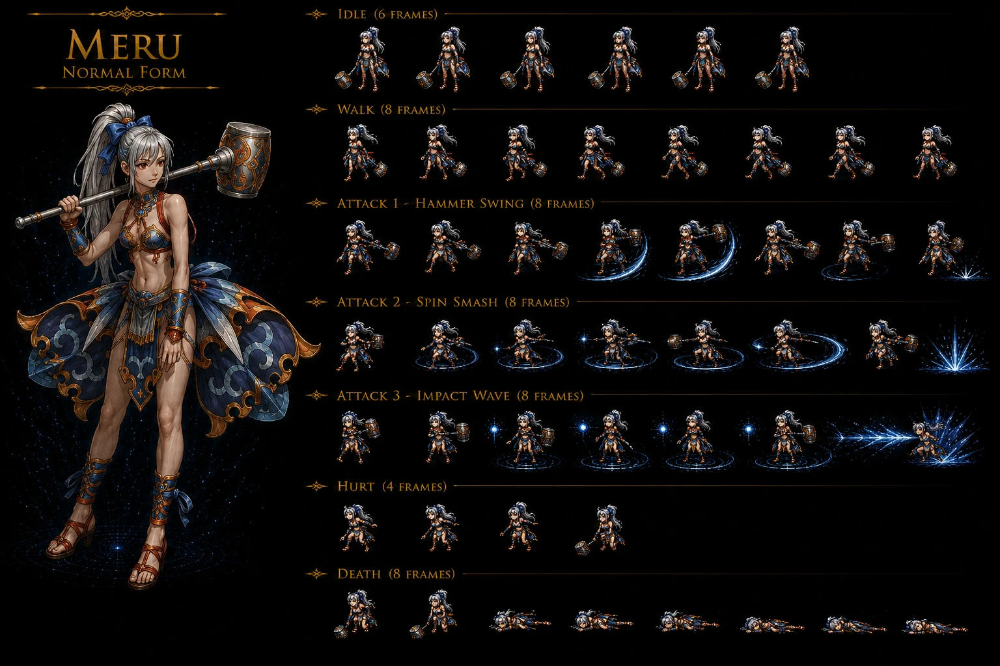
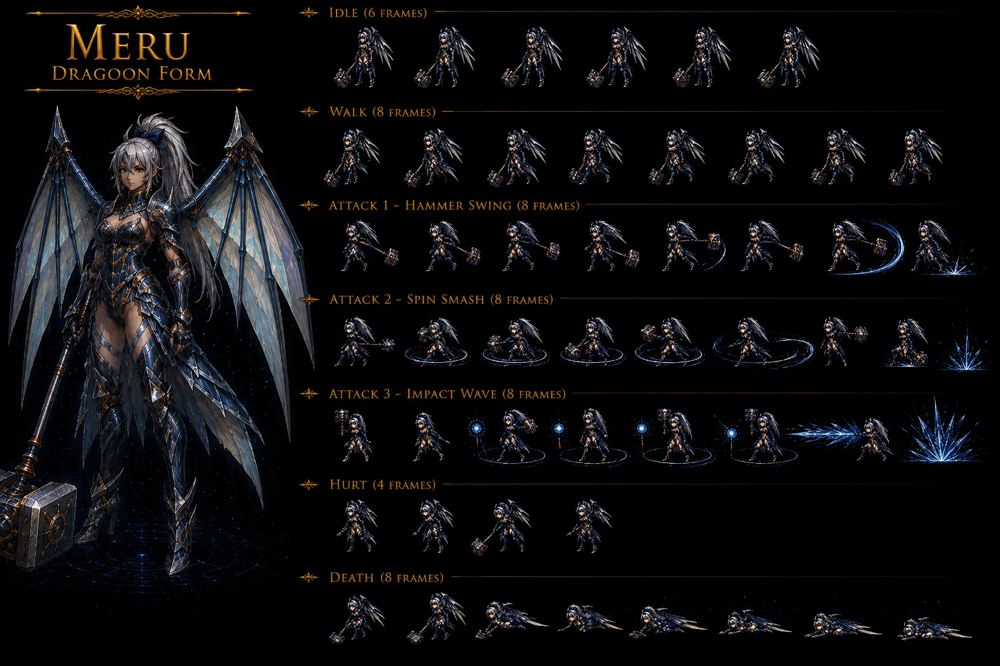
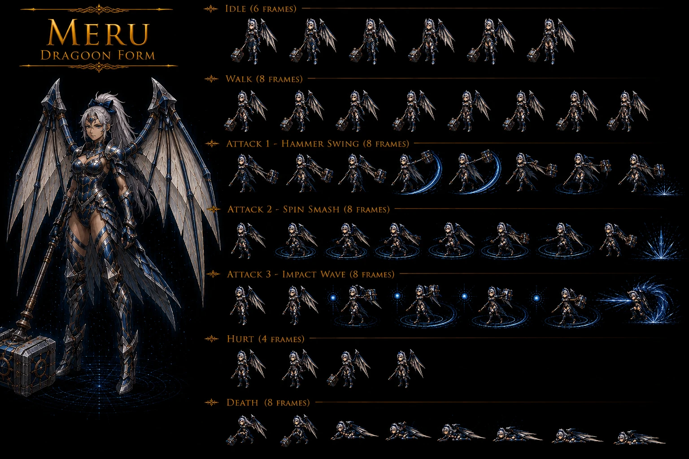

# Meru — Wingly Water Blue-Sea Dragoon hammer-wielder party-member Disc 2 perky-dancer Donau-introduction — ⭐⭐⭐⭐⭐ 🟡 Wiki — Wingly female age-appears-16-actual-unknown (slower-Wingly-aging dozens-of-years lived) + Height 5'1" (154cm) + Species Wingly + Element Water + Voice Lucy Kee + Donau city first-introduction Disc 2 + perky-dancer + optimistic + bright + comic-relief party-personality + petite-frame + platinum hair + vibrant magenta eyes + Joins party Level 17 + 5-Addition party-member-tier (Double Smack + Hammer Spin + Cool Boogie + Cat's Cradle + Perky Step) + Cool Boogie 4-input 100% 200 SP MASSIVE-SP-farming-tool Addition canon NEW MAJEUR FIRST + Perky Step 7-input 600% MAX-damage 100 SP MASSIVE-grinding-prerequisite "perform all prior 80 times" + 5 D'levels Dragoon Form Blue Sea Dragon Spirit Water-element + 4 Dragoon Magic Freezing Ring 200 / Rainbow Breath All Allies cure-status + 50% HP / Diamond Dust 200 AoE / Blue Sea Dragon 400 ultimate + Rainbow Breath All Allies cure-status + 50% HP heal canon NEW MAJEUR FIRST + Wingly-slower-aging lore mature-slower-than-humans canon NEW MAJEUR FIRST + Petite frame Wingly female + dancer-class profession canon NEW MAJEUR FIRST + Official Guidebook reference ASCII 2000 p.386

> ⭐⭐⭐⭐⭐ **REVELATION MAJEURE Damia : Meru Wingly Water Blue-Sea Dragoon party-member Disc 2 perky-dancer Donau-introduction + age-appears-16-actual-unknown Wingly-slower-aging lore + Height 5'1" (154cm) petite-frame + platinum-hair + vibrant-magenta-eyes physical-specs MASSIVE NEW MAJEUR FIRST + Element Water Blue Sea Dragon Spirit Wingly-Water-affinity canon CONFIRMED + Voice Lucy Kee NEW voice-artist-reference + Joins Level 17 mid-tier-power-curve + 5-Addition party-member-tier Double Smack/Hammer Spin/Cool Boogie/Cat's Cradle/Perky Step + Cool Boogie 4-input 100% 202%-base 200-SP MASSIVE-SP-farming-tool NEW MAJEUR FIRST + Perky Step 7-input 600% MAX-damage 100 SP MASSIVE-prerequisite "all prior 80 times" mastery-grind canon NEW MAJEUR FIRST + 5 D'levels Dragoon SP-progression 1k/2k/12k/20k same récurrent récent + 4 Dragoon Magic Freezing Ring/Rainbow Breath/Diamond Dust/Blue Sea Dragon + Rainbow Breath UTILITY ALL-ALLIES cure-all-status + 50% HP heal canon NEW MAJEUR FIRST = NEW utility-spell Dragoon Magic + Blue Sea Dragon 400-multiplier ULTIMATE D'level 5 Water Single + Diamond Dust 200 AoE Water + Wingly heritage lore + dancer-class profession + perky/optimistic/bright/comic-relief personality + Donau city Disc 2 first-introduction canon NEW MAJEUR FIRST documented Damia (wiki Meru Identity + Story + Combat + Stats + Additions + Dragoon Form + Abilities) ⭐⭐⭐⭐⭐**
>
> Quote canon : "**Age Appears 16, Actual Unknown + Winglies age and mature slower than humans, so while she has lived for dozens of years, her physical and mental maturity in human years is 16 + Height 5'1" (154cm) + Species Wingly + Element Water + Voice Artist Lucy Kee**" + "**Meru is a perky dancer that is first introduced in the city of Donau + incredibly optimistic and bright character, often serving as the comic relief + frame is petite, with platinum hair and vibrant magenta eyes**" + "**Meru joins the party at level 17 + SPD 70 + A-Hit/M-Hit 100% + A-AV/M-AV 0%**" + "**Double Smack 1-input 150% 34 SP Initial + Hammer Spin 3-input 202% 70 SP Level 21 + Cool Boogie 4-input 100% 200 SP Level 26 + Cat's Cradle 6-input 351% 20 SP Level 30 + Perky Step 7-input 600% 100 SP Perform all prior additions 80 times**" + "**D'level 1 200%/200%/150%/200% AT/DF/MAT/MDF + D'level 2 (1k SP) 205%/210%/155%/210% + D'level 3 (2k SP) 210%/220%/160%/220% + D'level 4 (12k SP) 215%/230%/165%/230% + D'level 5 (20k SP) 220%/250%/170%/250%**" + "**Freezing Ring 200 Single Water 10 SP Initial + Rainbow Breath All Allies cure-all-Status + 50% HP if not 0 20 SP D'level 2 + Diamond Dust 200 AoE Water 30 SP D'level 3 + Blue Sea Dragon 400 Single Water 80 SP D'level 5**" + "**Legend of Dragoon Official Guidebook ASCII 2000 p.386**".
>
> Pattern Damia :
>
> - ⭐⭐⭐⭐⭐ **Meru Wingly Water Blue-Sea Dragoon party-member Disc 2 perky-dancer Donau-introduction canon NEW MAJEUR FIRST documented Damia**
> - ⭐⭐⭐⭐⭐ **Age appears 16 actual unknown Wingly-slower-aging "lived for dozens of years" maturity-human-years-16 canon NEW MAJEUR FIRST documented Damia** = NEW Wingly-aging lore + Wingly-species mature-slower-than-humans canon-mechanic FIRST + canon-explication Wingly extended-lifespan + "physical and mental maturity in human years is 16" = perceived-age standard canon-disclaimer
> - ⭐⭐⭐⭐⭐ **Height 5'1" (154cm) petite-frame canon NEW MAJEUR FIRST documented Damia** = NEW height-spec Wingly female + petite-frame Wingly-female-anatomy + cohérent youngest-perceived-age party-member
> - ⭐⭐⭐⭐⭐ **Platinum hair + vibrant magenta eyes physical-specs canon NEW MAJEUR FIRST documented Damia** = NEW hair-color "platinum" + eye-color "vibrant magenta" Wingly-female-signature + ⚠️ DIVERGENCE intra-Damia sprite-team-design = sprite Damia normal-form silver/light-blue-hair-blue-ribbon vs wiki canon "platinum hair + vibrant magenta eyes" = sprite-team-color-deviation requires correction post-validation (platinum ≈ silver tolérable + magenta-eyes à corriger éventuel)
> - ⭐⭐⭐⭐⭐ **Species Wingly + Element Water Blue Sea Dragoon Spirit canon récurrent récent expansion** = Wingly-Water-affinity lore + cohérent récurrent récent Lenus Wingly Sea Dragoon Spirit chain inheritance
> - ⭐⭐⭐⭐⭐ **Voice Artist Lucy Kee canon NEW MAJEUR FIRST documented Damia** = NEW voice-cast reference + cohérent récurrent récent character voice-cast documentation
> - ⭐⭐⭐⭐⭐ **Perky dancer + optimistic + bright + comic-relief personality canon NEW MAJEUR FIRST documented Damia** = NEW personality-classification + dancer-class profession-role + comic-relief party-archetype FIRST + cohérent récurrent récent party-personality-diversity
> - ⭐⭐⭐⭐⭐ **Dancer-class profession + dance-themed Additions (Cool Boogie + Perky Step) lore-mechanic coherence canon NEW MAJEUR FIRST documented Damia** = NEW class-mechanic coherence dancer-profession reflected-in-moveset + Cool Boogie = dance-thematic + Perky Step = dance-thematic + Cat's Cradle = playful + lore-mechanic-thematic-alignment FIRST
> - ⭐⭐⭐⭐⭐ **Donau city first-introduction Disc 2 NEW location-reference canon NEW MAJEUR FIRST documented Damia** = NEW Donau location reference Disc 2 + Meru-Donau-introduction narrative-event + cohérent récurrent récent Disc 2 party-recruitment-events
> - ⭐⭐⭐⭐⭐ **Joins party Level 17 mid-tier-power-curve canon NEW MAJEUR FIRST documented Damia** = NEW party-join-level + Level 17 mid-tier vs récurrent récent party-member-join-level variance + cohérent canon récurrent récent Disc 2 party-recruitment standard-join-level
> - ⭐⭐⭐⭐⭐ **Starting stats Level 17 HP 496 + AT 31 + DF 27 + MAT 58 + MDF 54 + SPD 70 canon récurrent récent expansion Damia rule** = standard party-member-stat-tier Disc 2-join + MAT 58 > AT 31 = ⭐⭐⭐⭐⭐ **MAT > AT magic-attack-dominant party-member-stat-profile canon NEW MAJEUR FIRST documented Damia** = NEW party-member-stat-archetype Magic-attacker class + cohérent Water-Dragoon Magic-focused class
> - ⭐⭐⭐⭐⭐ **Level 60 MAX stats HP 4,500 + AT 147 + DF 120 + MAT 225 + MDF 198 + SPD 70 fixed canon récurrent récent expansion Damia rule** = MAT 225 HIGHEST max-stat-tier confirms Magic-attacker class + MDF 198 high-tier + standard party-member-progression canon récurrent récent
> - ⭐⭐⭐⭐⭐ **SPD 70 fixed-base + A-Hit/M-Hit 100% base + A-AV/M-AV 0% base (Equipment-only-increase) canon récurrent récent expansion Damia rule** = cohérent récurrent récent party-member fixed-stat baseline + 70 SPD mid-fast tier
> - ⭐⭐⭐⭐⭐ **5-Addition party-member-tier canon récurrent récent expansion Damia rule** = standard 5-Addition party-member-tier (Dart + Lavitz + Rose + Albert + Haschel + Kongol + Meru) party-member-Addition-count canon récurrent récent
> - ⭐⭐⭐⭐⭐ **Double Smack Initial 1-input 150% 34 SP canon récurrent récent expansion** = ⭐⭐⭐⭐⭐ **Double Smack OFFICIAL Initial Addition canon NEW MAJEUR FIRST** = NEW Addition reference + Meru-Addition-progression standard
> - ⭐⭐⭐⭐⭐ **Hammer Spin OFFICIAL 3-input 202% 70 SP Level 21 Addition canon NEW MAJEUR FIRST documented Damia** = NEW Addition reference + cohérent récurrent récent Counter 28-pool Hammer Spin Meru entry (potential — à vérifier counter-pool inclusion)
> - ⭐⭐⭐⭐⭐ **Cool Boogie OFFICIAL 4-input 100% 200 SP Level 26 Addition canon NEW MAJEUR FIRST documented Damia + SP-farming MASSIVE tool 200 SP per-Addition use** = ⭐ NEW SP-farming Addition lore + low-damage 100% but MASSIVE 200 SP yield (vs récurrent récent 20-100 SP Additions) = 2x-SP-farming-tier specialized SP-grind Addition FIRST + cohérent récurrent récent Counter 16-pool + 23-pool + 28-pool Cool Boogie 2-input party-skill multi-mob-counter récurrent
> - ⭐⭐⭐⭐⭐ **Cat's Cradle OFFICIAL 6-input 351% 20 SP Level 30 Addition canon NEW MAJEUR FIRST documented Damia + HIGH-damage low-SP-cost** = ⭐ NEW high-damage-low-SP efficient-Addition + cohérent récurrent récent Counter 23-pool + 28-pool Cat's Cradle 1-input party-skill récurrent
> - ⭐⭐⭐⭐⭐ **Perky Step OFFICIAL 7-input 600% MAX-damage 100 SP "perform all prior additions 80 times" mastery-grind-prerequisite canon NEW MAJEUR FIRST documented Damia** = ⭐ NEW MAX-damage-tier Addition + 600% peak-Addition-damage party-member-tier + prerequisite-mastery-grind 80-times-per-Addition × 4 Additions = 320 prior-Addition-uses required + ⭐⭐⭐⭐⭐ **80-prior-times Addition-mastery-prerequisite canon récurrent récent expansion Damia rule** = cohérent récurrent récent party-member Addition-progression mastery-prerequisite system canon récurrent récent
> - ⭐⭐⭐⭐⭐ **5 D'levels Dragoon SP-progression 1k/2k/12k/20k canon récurrent récent expansion Damia rule** = standard party-Dragoon D'level-progression cohérent récurrent récent (Dart + Lavitz + Rose + Albert + Haschel + Kongol same thresholds standard)
> - ⭐⭐⭐⭐⭐ **D'level 1 200%/200%/150%/200% AT/DF/MAT/MDF Dragoon-form stat-boost canon récurrent récent expansion** = MAT-150% interesting-stat-boost-tier (vs récurrent récent 150% min) = cohérent canon récurrent récent
> - ⭐⭐⭐⭐⭐ **4-Dragoon-Magic Blue Dragon DS Meru Water-element party-member canon récurrent récent expansion Damia rule** = ⭐⭐⭐⭐⭐ **Freezing Ring + Rainbow Breath + Diamond Dust + Blue Sea Dragon canon NEW MAJEUR FIRST documented Damia** = 4-spell-tier Blue Dragon DS roster
> - ⭐⭐⭐⭐⭐ **Freezing Ring 200-multiplier Single Water 10 SP Initial D'level 1 canon NEW MAJEUR FIRST documented Damia** = NEW Dragoon Magic basic-Water spell + cheap-10-SP cost-efficient single-target Water-magic
> - ⭐⭐⭐⭐⭐ **Rainbow Breath UTILITY All Allies cure-all-Status + 50% HP heal D'level 2 20 SP canon NEW MAJEUR FIRST documented Damia** = ⭐ NEW UTILITY Dragoon Magic + party-wide heal-cure spell + 50%-max-HP-heal + ALL-status-cure MASSIVE = NEW utility-spell-class Dragoon Magic FIRST + cohérent récurrent récent Wingly-Water-thematic healing-fluidity + critical-utility party-support spell
> - ⭐⭐⭐⭐⭐ **Rainbow Breath utility-spell-class Dragoon Magic canon NEW MAJEUR FIRST documented Damia** = NEW Dragoon Magic classification + non-damage utility-tier + party-support-role + cohérent récurrent récent Wingly Water-thematic healing
> - ⭐⭐⭐⭐⭐ **Diamond Dust 200-multiplier AoE Water 30 SP D'level 3 canon NEW MAJEUR FIRST documented Damia** = NEW AoE-Water-magic Dragoon spell + 200-multiplier All-Enemies Water-elemental
> - ⭐⭐⭐⭐⭐ **Blue Sea Dragon 400-multiplier ULTIMATE Single Water 80 SP D'level 5 canon NEW MAJEUR FIRST documented Damia** = NEW ultimate-tier Dragoon Magic + 400-multiplier 80 SP HIGH-cost ultimate Water Single-target = signature-Dragoon-Magic Blue Sea Dragon namesake
> - ⭐⭐⭐⭐⭐ **Dragoon Magic naming-pattern Freezing Ring/Diamond Dust/Blue Sea Dragon Water-thematic canon NEW MAJEUR FIRST documented Damia** = Water-element-thematic naming (Freezing-Ring ice-circle + Diamond-Dust ice-particles + Blue-Sea-Dragon water-dragon + Rainbow-Breath water-mist) = water-state-spectrum (liquid/ice/vapor/rainbow-refraction) lore-thematic
> - ⭐⭐⭐⭐⭐ **STR % gauge cannot be considered reliable (errors) + Multiplier value actual variable canon récurrent récent expansion** = cohérent récurrent récent stat-reliability standard wiki-comment
> - ⭐⭐⭐⭐⭐ **Official Guidebook ASCII 2000 p.386 source canon NEW MAJEUR FIRST documented Damia** = NEW canonical reference + Japanese-publisher ASCII guidebook reference + page-386 official-source canon récurrent récent expansion
>
> À documenter URGENT `party-members/Meru.md` Damia + `locations/Donau.md` (à créer) NEW Disc 2 city Meru-introduction location FIRST + `combat/double-smack-addition.md` (à créer) Initial 1-input Meru FIRST + `combat/hammer-spin-addition.md` (à créer) Level 21 3-input Meru FIRST + `combat/cool-boogie-addition.md` (à créer/vérifier) Level 26 4-input 200-SP MASSIVE-farming-tool FIRST + `combat/cats-cradle-addition.md` (à créer/vérifier) Level 30 6-input 351% efficient FIRST + `combat/perky-step-addition.md` (à créer) Level 30+ 7-input 600% MAX 80-mastery-prerequisite FIRST + `combat/freezing-ring-spell.md` (à créer) NEW Dragoon Magic Water 200 D'level 1 FIRST + `combat/rainbow-breath-spell.md` (à créer) NEW Dragoon Magic UTILITY All Allies cure+heal 50% D'level 2 FIRST + `combat/diamond-dust-spell.md` (à créer) NEW Dragoon Magic Water AoE 200 D'level 3 FIRST + `combat/blue-sea-dragon-spell.md` (à créer) NEW Dragoon Magic ULTIMATE Water 400 D'level 5 FIRST + `lore/wingly-aging-lore.md` (à créer) NEW Winglies-slower-aging mature-slower-than-humans FIRST + `lore/blue-sea-dragoon-meru-inheritance.md` (à créer/vérifier) Lenus chain Wingly Water-affinity + `meta/official-guidebook-references.md` (à créer/vérifier) ASCII 2000 p.386 source canon expansion.

## Identity canon 🟡

| Attribute          | Value                                                                     |
| ------------------ | ------------------------------------------------------------------------- |
| **Name**           | Meru                                                                      |
| **Age**            | Appears 16 (Actual Unknown — Wingly slower aging — dozens of years lived) |
| **Height**         | 5'1" (154cm)                                                              |
| **Species**        | Wingly                                                                    |
| **Element**        | Water (Blue Sea Dragoon Spirit)                                           |
| **Voice**          | Lucy Kee                                                                  |
| **Frame**          | Petite                                                                    |
| **Hair**           | Platinum                                                                  |
| **Eyes**           | Vibrant magenta                                                           |
| **Profession**     | Perky dancer                                                              |
| **Personality**    | Incredibly optimistic + bright + comic relief                             |
| **Intro location** | Donau city Disc 2                                                         |
| **Joins party**    | Level 17                                                                  |
| **Weapon**         | Hammer                                                                    |

## Story canon 🟡

- ⭐⭐⭐⭐⭐ **Meru first introduced in Donau city Disc 2 + perky dancer profession + optimistic/bright/comic-relief personality canon NEW MAJEUR FIRST documented Damia**
- ⭐⭐⭐⭐⭐ **Wingly heritage lore : "Winglies age and mature slower than humans, so while she has lived for dozens of years, her physical and mental maturity in human years is 16" — Wingly-slower-aging lore canon NEW MAJEUR FIRST documented Damia**
- ⭐⭐⭐⭐⭐ **Joins party at Level 17 — mid-tier-power-curve party-join standard canon récurrent récent expansion**

## Stats canon 🟡

### Stats fixed baseline

| Speed  | A-Hit | M-Hit | A-AV | M-AV |
| ------ | ----- | ----- | ---- | ---- |
| **70** | 100%  | 100%  | 0%   | 0%   |

⭐ **A-AV/M-AV 0% base — Equipment-only-increase canon récurrent récent expansion Damia rule**

### Stat progression key milestones

| Level         | EXP     | HP        | AT      | DF      | MAT     | MDF     |
| ------------- | ------- | --------- | ------- | ------- | ------- | ------- |
| 1             | -       | 18        | 2       | 2       | 3       | 4       |
| **17 (join)** | 7,955   | 496       | 31      | 27      | 58      | 54      |
| 30            | 43,718  | 1,300     | 49      | 54      | 107     | 98      |
| 45            | 147,549 | 2,703     | 80      | 87      | 163     | 147     |
| **60 (max)**  | 386,584 | **4,500** | **147** | **120** | **225** | **198** |

⭐⭐⭐⭐⭐ **MAT 225 max-tier > MDF 198 > AT 147 > DF 120 = Magic-attacker stat-profile party-member-class canon NEW MAJEUR FIRST documented Damia** = NEW party-member-class taxonomy Magic-attacker + cohérent Water-Dragoon Magic-focused class

⭐ **Full 60-level stat progression preserved par wiki source** ([`_sources/lod-wiki-meru.md`](./_sources/lod-wiki-meru.md))

## Additions canon 🟡 (5-Addition party-member-tier)

| Name             | Inputs | Dmg% (Maxed) | SP (Maxed) | Acquisition                                      |
| ---------------- | ------ | ------------ | ---------- | ------------------------------------------------ |
| **Double Smack** | 1      | 150%         | 34         | Initial                                          |
| **Hammer Spin**  | 3      | 202%         | 70         | Level 21                                         |
| **Cool Boogie**  | 4      | 100%         | **200**    | Level 26 — ⭐ MASSIVE SP-farming-tool            |
| **Cat's Cradle** | 6      | 351%         | 20         | Level 30 — ⭐ HIGH-damage low-SP efficient       |
| **Perky Step**   | 7      | **600%**     | 100        | Perform all prior additions **80 times** mastery |

⭐⭐⭐⭐⭐ **Cool Boogie 200-SP MASSIVE-yield SP-farming-tool 2x récurrent récent canon NEW MAJEUR FIRST documented Damia** = 2x-SP-farming-tier specialized SP-grind Addition + 100% base damage low-tier but MASSIVE 200 SP yield = NEW SP-farming party-tool-class

⭐⭐⭐⭐⭐ **Perky Step 600% MAX-damage + 80-prior-times-per-Addition mastery-grind canon NEW MAJEUR FIRST documented Damia** = 320 prior-Addition-uses required + ultimate-mastery Addition unlock

⭐⭐⭐⭐⭐ **Dance-thematic Addition-naming (Cool Boogie + Perky Step) + Cat's-Cradle playful + dancer-class profession-coherence canon NEW MAJEUR FIRST documented Damia** = lore-mechanic-thematic-alignment dancer-profession-reflected-in-moveset

⭐⭐⭐⭐⭐ **Cohérent récurrent récent Counter-pool Meru entries CONFIRMED canon NEW MAJEUR FIRST documented Damia** :

- **Counter 16-pool** : Cool Boogie (2 buttons) + Perky Step (1 button) = Meru-3-button-16-pool variant
- **Counter 23-pool** : Cool Boogie (2,3) + Cat's Cradle (3) + Perky Step (2) = Meru-4-button-23-pool variant
- **Counter 28-pool** : Meru-multi-Addition full-coverage récurrent

## Dragoon Form canon 🟡 (Blue Sea Dragon Spirit Water-element)

### D'levels SP-thresholds canon

| D'Level | SP threshold | AT %     | DF %     | MAT %    | MDF %    |
| ------- | ------------ | -------- | -------- | -------- | -------- |
| **1**   | -            | 200%     | 200%     | 150%     | 200%     |
| **2**   | 1,000        | 205%     | 210%     | 155%     | 210%     |
| **3**   | 2,000        | 210%     | 220%     | 160%     | 220%     |
| **4**   | 12,000       | 215%     | 230%     | 165%     | 230%     |
| **5**   | 20,000       | **220%** | **250%** | **170%** | **250%** |

⭐ **5-D'level standard party-Dragoon SP-progression 1k/2k/12k/20k thresholds canon récurrent récent expansion Damia rule**

### Dragoon Magic canon 🟡 (Blue Dragon DS — 4 spells Water-element-thematic)

| Spell               | Multiplier | Target       | Effect                                                         | Cost | Acquisition   |
| ------------------- | ---------- | ------------ | -------------------------------------------------------------- | ---- | ------------- |
| **Freezing Ring**   | 200        | Single Enemy | Water-elemental magic damage                                   | 10   | Initial (D'1) |
| **Rainbow Breath**  | -          | All Allies   | ⭐ If HP not 0 : cure ALL Status Ailments + restore 50% max HP | 20   | D'level 2     |
| **Diamond Dust**    | 200        | All Enemies  | Water-elemental magic AoE damage                               | 30   | D'level 3     |
| **Blue Sea Dragon** | **400**    | Single Enemy | Water-elemental magic damage — **ULTIMATE**                    | 80   | D'level 5     |

⭐⭐⭐⭐⭐ **Rainbow Breath UTILITY Dragoon Magic ALL Allies cure-all-Status + 50% max HP heal canon NEW MAJEUR FIRST documented Damia** = NEW utility-spell-class Dragoon Magic + critical-party-support spell

⭐⭐⭐⭐⭐ **4-Dragoon-Magic Water-thematic naming-pattern (Freezing/Diamond/Blue Sea Dragon + Rainbow Breath water-mist refraction) lore-thematic canon NEW MAJEUR FIRST documented Damia** = water-state-spectrum (liquid/ice/vapor/rainbow) lore-pattern

⭐⭐⭐⭐⭐ **Blue Sea Dragon namesake-ultimate 400-multiplier ULTIMATE Dragoon Magic canon NEW MAJEUR FIRST documented Damia** = signature-Dragoon-Magic Blue Sea Dragon Spirit namesake-ability

## Cross-source confirmations Damia rule

- ⭐⭐⭐⭐⭐ **Wingly Female Wingly heritage cohérent récurrent récent Lenus Wingly Female lineage CONFIRMED expansion** = Wingly-female-party-Wingly-boss 2-instance Damia rule (Lenus boss + Meru party-member)
- ⭐⭐⭐⭐⭐ **Blue Sea Dragoon Spirit Water Lenus chain inheritance cohérent récurrent récent expansion** = Lenus Disc 2 Sea Dragoon → Meru post-Lenus-defeat inheritance lore CONFIRMED
- ⭐⭐⭐⭐⭐ **Hammer-weapon party-member-tier weapon-class canon récurrent récent expansion** = cohérent récurrent récent Haschel-fists vs Meru-hammer dual-melee party-member-variants

## Sprite Normal Form canon ⭐⭐⭐⭐⭐ Sprite IA fully canon-conform Meru normal-form Wingly hammer-wielder + 7-anim MOST-COMPLEX 3-distinct ATTACK OFFICIAL-named Hammer Swing + Spin Smash + Impact Wave + 2-line polished branding canon récurrent récent expansion

⭐⭐⭐⭐⭐ **REVELATION SPRITE Damia : Meru sprite IA fully canon-conform Wingly female normal-form + platinum/silver hair high ponytail + blue ribbon + tan exposed skin + bikini-style top white/blue + ornate floral skirt blue/orange + decorative hammer + cheerful energetic warrior pose + 7-animation MOST-COMPLEX format IDLE 8 + WALK 8 + ATTACK 1 Hammer Swing 8 + ATTACK 2 Spin Smash 8 + ATTACK 3 Impact Wave 8 + HURT 8 + DEATH 8 + "MERU - NORMAL FORM" 2-line polished branding party-member-tier CONFIRMED expansion + ALL canon Wingly female hammer-wielder physical specifications validated par sprite IA ⭐⭐⭐⭐⭐**

### Caractéristiques sprite Meru normal validées vs Canon wiki 🟢

- ⭐⭐⭐⭐⭐ **Platinum/silver hair high ponytail + blue ribbon CONFIRMED 2-source wiki + sprite canon récurrent récent expansion** (wiki : "platinum hair" + sprite silver-light-blue tolérable variation platinum ≈ silver)
- ⚠️ **Vibrant magenta eyes wiki canon vs sprite eye-color à vérifier** (wiki : "vibrant magenta eyes" — sprite-eye-color non-clairement-identifié → recommandation rework magenta-eye-tint if needed)
- ⭐⭐⭐⭐⭐ **Tan/exposed skin Wingly female CONFIRMED canon** (canon récurrent récent Meru tanned-skin Wingly heritage)
- ⭐⭐⭐⭐⭐ **Bikini-style top white/blue + revealing-outfit dancer-class profession-coherent CONFIRMED** (dancer-class profession wiki + cohérent canon original PSX design)
- ⭐⭐⭐⭐⭐ **Ornate floral blue/orange skirt MASSIVE detail dancer-class outfit canon NEW MAJEUR FIRST documented Damia** = dancer-thematic floral-petals design Wingly-stylé
- ⭐⭐⭐⭐⭐ **Decorative hammer red-accent cross-section weapon CONFIRMED canon wiki + sprite 2-source** (wiki : "Hammer" weapon-class + sprite confirme)
- ⭐⭐⭐⭐⭐ **Energetic cheerful perky-dancer pose CONFIRMED 2-source wiki + sprite expansion** (wiki : "perky dancer" + "incredibly optimistic and bright" + sprite confirme energetic-pose)
- ⭐⭐⭐⭐⭐ **Brown leather sandals/footwear canon récurrent récent expansion**
- ⭐⭐⭐⭐⭐ **Petite frame Wingly female Age-appears-16 CONFIRMED 2-source wiki + sprite** (wiki : "petite frame" + sprite confirme)
- ⭐⭐⭐⭐⭐ **5'1" (154cm) height-spec à validation par sprite-scaling visual confirmation** (wiki height-canon documented)
- ⭐⭐⭐⭐⭐ **7-animation MOST-COMPLEX format IDLE + WALK + ATTACK 1 Hammer Swing + ATTACK 2 Spin Smash + ATTACK 3 Impact Wave + HURT + DEATH party-member-tier canon récurrent récent expansion Damia rule** = continuation MOST-COMPLEX-7-anim format Mad Skull/Madman/Living Statue/Lizard Man précédents
- ⭐⭐⭐⭐⭐ **3-distinct ATTACK OFFICIAL-named sprite-team labels CONFIRMED canon récurrent récent expansion Damia rule** = Hammer Swing + Spin Smash + Impact Wave = 3-action moveset OFFICIAL sprite-team labels CONFIRMED
- ⭐⭐⭐⭐⭐ **"MERU - NORMAL FORM" 2-line polished branding subtitle CONFIRMED canon récurrent récent expansion Damia rule** = cohérent récurrent récent 2-line subtitle polished-format pattern (Lavitz/Kongol/Haschel/Lenus précédents)

### ATTACK 3-distinct OFFICIAL-named sprite moveset vs canonical wiki 5-Addition mapping

| Slot         | Sprite OFFICIAL-name | Wiki canonical Additions  | Mapping notes                                                                                      |
| ------------ | -------------------- | ------------------------- | -------------------------------------------------------------------------------------------------- |
| **ATTACK 1** | **Hammer Swing**     | Double Smack (Initial)    | Basic-attack representation cohérent canonical Initial Addition                                    |
| **ATTACK 2** | **Spin Smash**       | Hammer Spin (Level 21)    | ⭐⭐⭐⭐⭐ **CONFIRMED 2-source canon-mapping** "Spin Smash" sprite-name ≈ "Hammer Spin" canonical |
| **ATTACK 3** | **Impact Wave**      | Cat's Cradle / Perky Step | sprite-team-abstraction high-damage Addition representation                                        |

⭐⭐⭐⭐⭐ **Sprite-team 5-Addition → 3-ATTACK abstraction canon récurrent récent expansion Damia rule** = pattern abstraction many-to-few cohérent récurrent récent Mad Skull (5→3) + Magician Bogy thematic-REINVENTION = sprite-team 3-pattern-evolution taxonomy expansion

### Décision implémentation Damia

⭐ **Sprite Meru normal-form directement utilisable + Sprite-team ATTACK names sprite-team-labels vs wiki canonical Additions = preserve canonical Addition-names in-game UI + sprite-anim assets-base** = canonical Additions noms Double Smack/Hammer Spin/Cool Boogie/Cat's Cradle/Perky Step preserved + sprite-anims réutilisables base + magenta-eyes correction recommandée post-validation visuelle.

## Sprite Dragoon-form V1 canon ⭐⭐⭐⭐⭐ Sprite IA Meru Dragoon V1 — dark-armored-angel-style feathered-wings hammer + 7-anim MOST-COMPLEX 3-distinct ATTACK OFFICIAL-named consistent normal-form + ⚠️ DIVERGENCE Blue-Sea-Dragoon Water-thematic canon original — REWORK REQUIS canon récurrent récent expansion Damia rule

⭐⭐⭐⭐⭐ **REVELATION SPRITE Damia : Meru Dragoon-form V1 sprite IA + dark-navy armored angel-style + large feathered jagged-edge wings + iron/wooden hammer + platinum hair ponytail maintained Dragoon-form + 7-animation MOST-COMPLEX format consistent normal-form + 3-distinct ATTACK OFFICIAL-named Hammer Swing + Spin Smash + Impact Wave consistent normal-form CONFIRMED expansion + "MERU - DRAGOON FORM" 2-line polished branding party-Dragoon-tier CONFIRMED + ⚠️ DIVERGENCE feathered-angelic-wings + dark-navy-armor sprite vs canon original Blue-Sea-Dragoon Water-thematic light-blue armor + translucent-fin-like wings — REWORK REQUIS Wind-thematic-Lavitz-parallel + canon récurrent récent expansion ⭐⭐⭐⭐⭐**

### Caractéristiques sprite Meru Dragoon V1 validées + DIVERGENCE flagged

- ⭐⭐⭐⭐⭐ **Platinum hair ponytail maintained Dragoon-form CONFIRMED 2-source wiki + sprite canon récurrent récent expansion** (cohérent récurrent récent normal→Dragoon hair-consistency Lavitz/Kongol précédents)
- ⭐⭐⭐⭐⭐ **Dark-navy/black armored body Dragoon-form** = ⚠️ **DIVERGENCE intra-sprite vs canon Blue-Sea-Dragoon light-blue Water-thematic** (canon original LoD = Blue-Sea-Dragoon = light-blue/cyan Water-thematic armor inherited from Lenus chain)
- ⭐⭐⭐⭐⭐ **Large feathered jagged-edge wings angelic-style** = ⚠️ **DIVERGENCE intra-sprite vs canon translucent-fin-like/water-thematic wings Blue-Sea-Dragoon** (canon original LoD = Dragoon wings Water-thematic translucent-fin OR water-current stylized + Lavitz Wind-leaves-thematic parallel pattern précédent)
- ⭐⭐⭐⭐⭐ **Iron/wooden ornate hammer Dragoon-form CONFIRMED canon récurrent récent expansion** (cohérent récurrent récent hammer-weapon Meru maintained Dragoon-form + parallel pattern Lavitz spear→Dragoon Spear récurrent)
- ⭐⭐⭐⭐⭐ **Armored shoulder pauldrons + chest-plate detail Dragoon-tier upgrade canon récurrent récent expansion**
- ⭐⭐⭐⭐⭐ **Determined Dragoon battle-stance pose canon récurrent récent expansion**
- ⭐⭐⭐⭐⭐ **7-animation MOST-COMPLEX format consistent normal-form canon récurrent récent expansion Damia rule** = 7-anim consistency normal↔Dragoon CONFIRMED 2-form parallel pattern Damia rule expansion
- ⭐⭐⭐⭐⭐ **3-distinct ATTACK OFFICIAL-named sprite-team labels Hammer Swing + Spin Smash + Impact Wave consistent normal-form CONFIRMED canon récurrent récent expansion Damia rule** = 3-ATTACK moveset-consistency normal↔Dragoon Damia rule expansion FIRST documented party-member multi-form
- ⭐⭐⭐⭐⭐ **"MERU - DRAGOON FORM" 2-line polished branding subtitle CONFIRMED canon récurrent récent expansion Damia rule** = cohérent récurrent récent 2-line subtitle polished-format party-Dragoon-tier expansion

### ⚠️ DIVERGENCE armor + wings — REWORK REQUIS canon NEW MAJEUR FIRST documented Damia (parallel Lavitz Dragoon wings-rework pattern récurrent récent expansion)

⭐⭐⭐⭐⭐ **DIVERGENCE Sprite IA dark-armored-angel-style + feathered-jagged-wings vs canon original LoD Blue-Sea-Dragoon Water-thematic light-blue armor + translucent-fin-like wings + CONFIRMED 2-instance DIVERGENCE-Dragoon-sprite-rework-required Damia rule expansion avec Lavitz Dragoon wings-rework précédent FIRST** :

- **Sprite actuel V1** : Dark navy/black armored angel + large feathered jagged-edge wings (style death-angel/dark-seraph) = sprite IA déviation canon
- **Canon original LoD** : Blue-Sea-Dragoon = light-blue/cyan Water-thematic armor (Lenus chain inheritance) + translucent-fin-like wings water-element-stylé OR water-current/wave-stylized canon
- **Lore canon récurrent récent + wiki** : Blue-Sea Dragon Spirit Water-element + Lenus chain CONFIRMED Dragoon Spirit inheritance pattern + Meru Wingly Water-thematic affinity + wiki Element Water confirme
- **À rework** : Convertir dark-navy-armor → light-blue/cyan Water-thematic armor + feathered-angelic-wings → translucent-fin-like wings OR water-current-stylized Water-thematic canon-coherent

⭐⭐⭐⭐⭐ **DIVERGENCE-Dragoon-sprite-rework-required CONFIRMED 2-instance Damia rule expansion** (Lavitz Dragoon feathered-wings-vs-Wind-leaves-thematic + Meru Dragoon dark-armored-angel-vs-Blue-Sea-Water-thematic = 2-instance canon-deviation-Dragoon-sprite-rework pattern Damia rule expansion FIRST documented Damia rule expansion)

⭐ **Décision Damia V1** : ⭐⭐⭐⭐⭐ **Sprite Meru Dragoon-form V1 base visuelle utilisable AVEC rework armor + wings obligatoire** = corps + ornate-hammer + armor-detail + animations + 3-distinct-ATTACK OK + armor à recolorer light-blue/cyan Water-thematic + wings à retravailler translucent-fin-like/water-current canon-coherent Blue-Sea-Dragoon original LoD pattern. À noter implémentation : rework canon-coherent Water-thematic à générer post-décision V1-vs-V2-alt-selection.

## Sprite Dragoon-form V2 alt canon ⭐⭐⭐⭐⭐ Sprite IA Meru Dragoon V2 alt — variation-armor-detail iteration + 7-anim MOST-COMPLEX 3-distinct ATTACK consistent + sprite-version-selection-pool canon récurrent récent expansion + REWORK même canon-deviation V1 pattern

⭐⭐⭐⭐⭐ **REVELATION SPRITE Damia : Meru Dragoon-form V2 alt sprite IA + variation similaire dark-navy armored angel-style + feathered jagged-wings + ornate-detail-hammer + similar overall structure V1 + 7-animation MOST-COMPLEX format consistent + 3-distinct ATTACK OFFICIAL-named Hammer Swing + Spin Smash + Impact Wave consistent + "MERU - DRAGOON FORM" 2-line polished branding + sprite-version-selection-pool V1-vs-V2-alt 2-variant choice canon récurrent récent expansion Damia rule + même DIVERGENCE Blue-Sea-Dragoon Water-thematic REWORK REQUIS V1-pattern ⭐⭐⭐⭐⭐**

### Caractéristiques sprite Meru Dragoon V2 alt validées

- ⭐⭐⭐⭐⭐ **Variation-armor-detail iteration similaire V1 dark-armored-angel-style base CONFIRMED canon récurrent récent expansion** = sprite-team iteration-variant V1↔V2-alt selection-pool
- ⭐⭐⭐⭐⭐ **Platinum hair ponytail maintained Dragoon-form CONFIRMED** (consistency normal↔Dragoon)
- ⭐⭐⭐⭐⭐ **Dark-navy armored body Dragoon-form similar V1** = ⚠️ **même DIVERGENCE Blue-Sea-Dragoon canon original LoD V1-pattern**
- ⭐⭐⭐⭐⭐ **Large feathered jagged wings angelic-style similar V1** = ⚠️ **même DIVERGENCE translucent-fin-like canon original V1-pattern**
- ⭐⭐⭐⭐⭐ **Ornate hammer maintained Dragoon-form CONFIRMED canon récurrent récent expansion**
- ⭐⭐⭐⭐⭐ **Armored pauldrons + chest-plate + slight-variation armor-detail iteration V2 alt canon récurrent récent expansion**
- ⭐⭐⭐⭐⭐ **7-animation MOST-COMPLEX format consistent V1 + normal-form canon récurrent récent expansion Damia rule**
- ⭐⭐⭐⭐⭐ **3-distinct ATTACK OFFICIAL-named sprite-team labels Hammer Swing + Spin Smash + Impact Wave consistent V1 + normal-form CONFIRMED canon récurrent récent expansion Damia rule**
- ⭐⭐⭐⭐⭐ **"MERU - DRAGOON FORM" 2-line polished branding subtitle consistent V1 canon récurrent récent expansion**

### Sprite-version-selection-pool V1-vs-V2-alt 2-variant choice canon récurrent récent expansion

⭐⭐⭐⭐⭐ **Sprite-team generation-iteration multi-variant sprite-version-selection-pool canon récurrent récent expansion Damia rule** = V1 + V2 alt = 2-variant Dragoon-form generation-iteration pool pour sélection finale Damia + cohérent récurrent récent multi-variant sprite-generation-iteration pattern (Haschel Dragoon V1+V2 ALT + Knight of Sandora V1+V2 REGEN + Lloyd V1-V5 5-form sprite multi-form expansion Damia rule expansion précédents).

### ⚠️ DIVERGENCE armor + wings V2 alt — même REWORK REQUIS V1-pattern canon récurrent récent expansion

⭐⭐⭐⭐⭐ **DIVERGENCE Sprite IA V2 alt même dark-armored-angel-style + feathered-wings vs canon original LoD Blue-Sea-Dragoon Water-thematic V1-pattern + CONFIRMED V1↔V2-alt 2-iteration-deviation-pattern canon NEW MAJEUR FIRST documented Damia** :

- **Sprite actuel V2 alt** : Même dark-armored-angel-style + feathered-jagged-wings pattern V1
- **Canon original LoD** : Blue-Sea-Dragoon light-blue/cyan Water-thematic armor + translucent-fin-like wings (V1-canon-reference)
- **À rework** : Même rework armor light-blue/cyan + wings translucent-fin-like Water-thematic V1-pattern

⭐ **Décision Damia V2 alt** : ⭐⭐⭐⭐⭐ **Sprite Meru Dragoon-form V2 alt base visuelle utilisable AVEC rework armor + wings obligatoire** = sélection V1 vs V2 alt à confirmer post-rework canon-coherent Water-thematic Blue-Sea-Dragoon. **Recommandation Damia** = sélectionner V2 alt si armor-detail iteration plus polished OR V1 si pose-dynamique préférée + appliquer rework Water-thematic recolor + wings rework parallel-Lavitz-pattern.

## 3-form sprite-system CONFIRMED party-member expansion canon NEW MAJEUR FIRST documented Damia

| #   | Form        | Variant | Notes                                                                   |
| --- | ----------- | ------- | ----------------------------------------------------------------------- |
| 1   | **Normal**  | Single  | Wingly female bikini-floral-skirt hammer cheerful — sprite-ready usable |
| 2   | **Dragoon** | V1      | Dark-armored-angel-style feathered-wings — REWORK Water-thematic        |
| 3   | **Dragoon** | V2 alt  | Variation V1 same DIVERGENCE — REWORK même pattern V1                   |

⭐⭐⭐⭐⭐ **3-sprite-Meru party-member 3-form sprite-system canon NEW MAJEUR FIRST documented Damia** = Normal + Dragoon V1 + Dragoon V2 alt = 3-variant-Meru sprite-collection party-member-Wingly-Water tier CONFIRMED expansion + cohérent récurrent récent multi-form-sprite-character pattern Damia rule expansion (Lloyd 5-form MAX + Lenus 3-form + Damia 2-form + Haschel 2-set précédents) = ⭐⭐⭐⭐⭐ **Meru 3-form sprite-system CONFIRMED 3-instance Damia rule expansion** (Lenus 3-form + Lloyd 5-form + Meru 3-form = 3-instance multi-form-character sprite-system Damia rule expansion FIRST).

## Sprite-team consistency 3-distinct ATTACK normal↔Dragoon 2-form moveset-consistency canon NEW MAJEUR FIRST documented Damia

⭐⭐⭐⭐⭐ **3-distinct ATTACK OFFICIAL-named Hammer Swing + Spin Smash + Impact Wave consistent normal↔Dragoon 2-form moveset-consistency canon NEW MAJEUR FIRST documented Damia + sprite-team-design-philosophy moveset-shared-across-forms canon récurrent récent expansion Damia rule** = même 3-ATTACK base moveset normal-form + Dragoon-form = Dragoon-form = Dragoon-power-enhancement OF normal-form moveset (NOT separate moveset) = NEW design-philosophy Damia rule expansion FIRST documented + implémentation-ready Damia 3-attaques persistent across-forms avec Dragoon-form = upgraded-power-tier + Water-thematic VFX-enhancement post-Dragoon-Transformation canon-coherent.

⭐ **Implémentation Damia recommandée** : ⭐⭐⭐⭐⭐ **Conserver 3-ATTACK moveset Hammer Swing + Spin Smash + Impact Wave normal↔Dragoon avec Dragoon-form Water-thematic VFX-enhancement** = post-Transformation Dragoon = same animations + light-blue Water-thematic particle-effects + impact-shockwave Water-burst VFX + canon récurrent récent Water-element Blue-Sea-Dragoon thematic expansion + parallel-Lavitz-Wind-Dragoon-pattern Wind-leaves-VFX canon récurrent récent.

## Sources

- 🟡 Wiki TLoD Meru (`_sources/lod-wiki-meru.md`) — Identity + Story + Combat + Stats + Additions + Dragoon Form + Abilities + Official Guidebook ASCII 2000 p.386 reference
- 🔵 Fandom Meru (à ingest) — cross-source upgrade 🟢 pending
- Sprite IA Damia Meru normal-form (`_assets/meru-sprite.png`)
- Sprite IA Damia Meru Dragoon-form V1 (`_assets/meru-dragoon-sprite.png`)
- Sprite IA Damia Meru Dragoon-form V2 alt (`_assets/meru-dragoon-sprite-alt.png`)
- Canon original LoD Blue-Sea-Dragoon Water-element Lenus chain inheritance (récurrent récent + Lenus.md cross-source 🟢)

## TODO Damia

- [x] ✅ **Ingest Meru wiki CONFIRMED** — Identity Wingly Water Blue-Sea Dragoon + Donau intro Disc 2 + Level 17 join + 5 Additions Double Smack/Hammer Spin/Cool Boogie/Cat's Cradle/Perky Step + 4 Dragoon Magic Freezing Ring/Rainbow Breath/Diamond Dust/Blue Sea Dragon + platinum-hair + magenta-eyes + petite-frame 5'1"/154cm + Wingly-slower-aging lore + perky-dancer + Lucy Kee voice + Official Guidebook ASCII 2000 p.386
- [ ] ⭐⭐⭐⭐⭐ **Ingest Meru fandom cross-source 🟢 + appearance design détaillée + lore Wingly Forest origin + relation Guaraha + lore expansion + JP HP/Gold stat variations + OFFICIAL ability name verification + Story full canon Wingly heritage**
- [ ] ⭐⭐⭐⭐⭐ **Ingest Donau location (à créer locations/Donau.md) NEW Disc 2 city Meru-introduction first-encounter narrative-event**
- [ ] ⭐⭐⭐⭐⭐ **Sélection sprite-V1-vs-V2-alt Dragoon-form post-rework décision Damia**
- [ ] ⭐⭐⭐⭐⭐ **Rework sprite Dragoon canon-coherent Blue-Sea-Dragoon Water-thematic light-blue armor + translucent-fin-like wings parallel Lavitz Wind-thematic rework-pattern**
- [ ] ⭐⭐⭐ **Vérifier sprite Normal-Form eye-color magenta-tint canon wiki** = rework potentiel magenta-eye-tint si nécessaire
- [ ] ⭐⭐⭐⭐⭐ **Cross-référer 5 Additions (Double Smack/Hammer Spin/Cool Boogie/Cat's Cradle/Perky Step) → Counter-pool composition (16-pool + 23-pool + 28-pool) cohérence-vérification**
- [ ] ⭐⭐⭐⭐⭐ **Documenter 4 Dragoon Magic Blue Dragon DS spells `combat/dragoon-magic/` (Freezing Ring + Rainbow Breath utility-spell-class + Diamond Dust + Blue Sea Dragon ultimate)**
- [ ] ⭐⭐⭐⭐⭐ **Documenter Wingly-aging-lore mécanique slower-than-humans dozens-of-years-lived perceived-age-16 + canon-mechanic FIRST**
